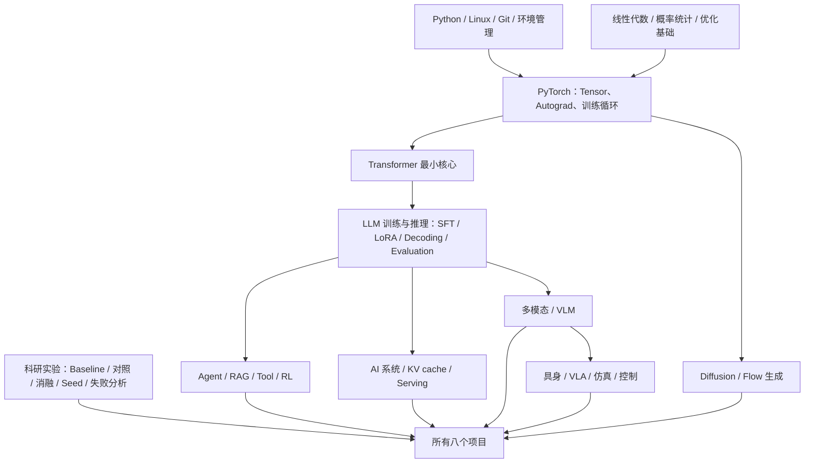

# 共同知识树与八项学习负担 V1

> 快照：2026-08-24。估计默认用户初试后已有数学、408、C 和初步 Python/Linux/Git，每天可学习 8 小时以上，可用 Agent 辅助，但必须亲自掌握核心概念和代码。时间是达到“能读该项目核心代码并解释实验”的粗略估计，不是精通周期。

## 一、Agent 其实是什么

Agent 通常不是一种新的神经网络。可以先把它理解成：

> **一个大模型 + 当前任务状态 + 可调用的工具 + 反复执行/观察/修正的循环 + 评价成功与否的反馈。**

- **RAG**：开卷考试；模型回答前去查外部资料。
- **Tool use**：模型不只打字，还会调用搜索、计算器、编译器、浏览器或某个 API。
- **Planning**：把长任务分解成步骤，并在工具返回新信息后改计划。
- **Memory**：保留之前步骤中对未来有用的信息，避免全部塞进上下文。
- **Agent RL**：把“最终任务成没成”或过程中的执行结果当成奖励，训练模型何时思考、用什么工具、失败后怎么修。

因此，不熟 Agent 不等于必须先学一套庞大的新数学。它主要是对 LLM、软件系统和实验评估的组合；不同 Agent 项目才会额外需要 RAG、RL、代码执行或机器人控制。

## 二、八个候选的共同知识树

## 三、最值得先学的通用干线

### 1. Python/Linux/Git/环境管理

目标不是会所有命令，而是能独立克隆仓库、创建 conda/venv、读报错、固定版本、保存日志、提交自己的改动。预计 2—3 天达到项目最小水平，之后边做边补。

### 2. PyTorch 与深度学习训练循环

必须理解 tensor shape、batch、forward、loss、backward、optimizer、checkpoint、train/eval 模式、过拟合。要能亲手写一个小模型训练与评估脚本。预计 3—5 天。

### 3. Transformer 最小核心

这是最值得的共同投资，直接或间接覆盖八项中大约六至七项。最少需理解：

- token/embedding；
- self-attention，Q/K/V 各在做什么；
- multi-head attention、causal mask、residual、LayerNorm、MLP；
- 位置编码与 RoPE 的目的；
- 训练时并行、生成时自回归的差异；
- KV cache 为什么加速，又为什么占显存；
- MHA/GQA/MLA 先达到“知道为什么存在”，不用立即掌握所有推导。

预计 4—6 天建立最小骨架，之后在候选项目中继续深入。

### 4. LLM 训练与推理词汇

- **Pre-training**：在大量数据上学通用预测能力；八项中都不要从零做。
- **SFT**：用“输入—理想输出”样本继续训练，教模型学一种行为格式。
- **LoRA**：冻结大部分参数，只训小型低秩适配器，降低训练成本。
- **DPO/RLHF/RLVR/GRPO**：都在试图用偏好或可验证奖励改造模型行为，方法不同，不需要第一周就全部掌握。
- **Decoding/inference**：模型怎样一个 token 一个 token 生成，以及 temperature/top-p/beam/search 如何改变结果和成本。

预计 3—4 天建立概念和小模型 LoRA/SFT 体验。RL 只在 Fine-R1/SWE 等入围后深学。

### 5. 科研实验素养

这比多记几个模型名更重要：

- baseline 与你的方法必须在同一数据/预算/评测下比较；
- 一次运行不代表规律，需要多 seed、置信区间或至少重复实验；
- 消融用于回答“到底是哪个部分有用”；
- 不只报平均分，还要找失败类型和边界；
- 训练/验证/测试集、数据污染、评价指标的适用性必须讲清。

这部分不应单独闭门学完，而应从第一个小实验就开始使用。

## 四、通用干线需要多久

上述时间有大量重叠，不应简单相加。全职 8 小时/天的合理目标是：

- **10—14 天**：建立能支持选题的通用干线，能读 Transformer/LLM 项目的数据流，能跑小训练/推理，能看基础实验表。
- 这不是“14 天学会大模型”，而是拿到继续学习任一入围项目的公共钥匙。
- 这段时间不会浪费：即使最后选具身、多模态或系统，Transformer/PyTorch/实验素养都会用到。

## 五、八项的额外知识与学习负担

| 项目 | 通用干线之外还要学 | 主要工程能力 | 达到项目阅读水平的额外估计 | 学习风险 |
|---|---|---|---:|---|
| SWE-MiniSandbox | Agent、SWE-bench、执行奖励、RL基础、Linux namespace/chroot/mount | Linux环境隔离、依赖缓存、并发与测试 | 7—10天 | 中高，但学习链较线性 |
| TongGeometry | 形式几何DSL、演绎推理、搜索树、policy/value引导 | 符号引擎、搜索调试、证明正确性 | 14—21天 | 很高，数学/形式语义是主瓶颈 |
| TransMLA | GQA/MLA/RoPE、低秩迁移、KV cache、PPL、吞吐/延迟 | vLLM/SGLang、GPU显存和性能profiling | 12—18天 | 高，但与408/系统基础协同 |
| PQCache | Product Quantization、MIPS、长上下文注意力、LongBench | CUDA/FlashAttention环境、CPU/GPU搬运、性能实验 | 10—14天 | 高但边界清晰，比TransMLA略线性 |
| RoboTwin 2.0 | 仿真、ACT/模仿学习、VLA概念、域随机化、机器人指标 | SAPIEN/CuRobo、数据采集、policy server、多seed episode | 18—25天 | 很高，知识和调试链都长 |
| RMBench/Mem-0 | RoboTwin全部+长程记忆、VLM/VLA、因果消融 | 多模型服务、记忆库、长episode评测 | 25—35天 | 极高，是目前最容易挤压创新时间的一项 |
| Fine-R1 | 视觉编码器/VLM、CoT-SFT、RLVR/GRPO类方法、reward、细粒度识别 | LLaMA-Factory/EasyR1、多GPU训练、图像数据与评估 | 14—21天 | 高，但与热门词汇和通用干线重合最高 |
| MagCache | diffusion/flow采样、时间步、residual cache、PSNR/LPIPS/VBench | 生成模型环境、GPU profiling、批量视觉评估 | 10—14天 | 中高，理论较集中，依赖链较复杂 |

这些“额外天数”不会在项目开始前全部完成，而是与跑基线重叠。但它能揭示一个关键区别：这些项目的主风险并不都是 GPU。RMBench/TongGeometry 主要是认知链，RoboTwin 是认知+工程链，Fine-R1 是训练+评估链，PQCache/TransMLA 是 Transformer+性能归因链。

## 六、“是不是让我复现他们的论文”

答案是：**复现是起点，不是最终项目；而且不会要求复制原论文的全部规模。**

预期路径是：

1. **最小锚点复现**：固定提交和环境，在小数据/小模型/单任务上重现一条核心曲线、一个表格子集或一类成功现象。
2. **吃透核心链**：能说清数据怎么进、哪个模块改了什么、指标怎么算、原方法为什么有效。
3. **失败地图**：改数据、资源预算、扰动或模型设置，找出原方法在什么情况下失效。
4. **一个小而明确的改动**：对一个失败机制提出假设，只改一到两个关键点。
5. **对照、消融与失败条件**：证明结果不是巧合或单纯多用算力，并说清局限。

所以最终不是“我复现了北大老师的论文”，而是：

> “我用这篇近期工作作为可核验基线，在某个边界找到了具体失败，提出一个有原因的改动，并用这些对照证明了它在哪里有用、哪里没用。”

## 七、70 天的建议分配

| 时间 | 主任务 | 退出标准 |
|---|---|---|
| 第1—10天 | 通用干线+目标分支最小课程 | 无法讲清基本数据流，暂停该方向 |
| 第11—14天 | 正确环境单样本/小基线 | 付费正确环境仍无法跑通，换备选 |
| 第15—28天 | 复现核心表格/曲线的缩小版 | 指标无法重算或结果无法解释，缩小或退出 |
| 第29—38天 | 读核心代码+失败地图 | 找不到非平凡问题，不强造创新 |
| 第39—52天 | 改动+第一轮对照 | 无信号时执行早停，不无限扫参 |
| 第53—62天 | 消融、鲁棒性、多seed、绘图 | 优先保住可复现基线和失败结论 |
| 第63—70天 | 仓库、论文式报告、演示、答辩问题库 | 所有 Agent 生成代码必须亲自复现/解释 |

## 八、现在是什么阶段

现在已经进入**挑选阶段的前半段：知识与工程可掌握性审计**，还没到最终定项目。

下一步由总控按 V1 权重对八项出带区间的初评分，再根据这份学习负担压到 4—5 项。用户暂时不需要凭自己还没建立的专业直觉选一项。

